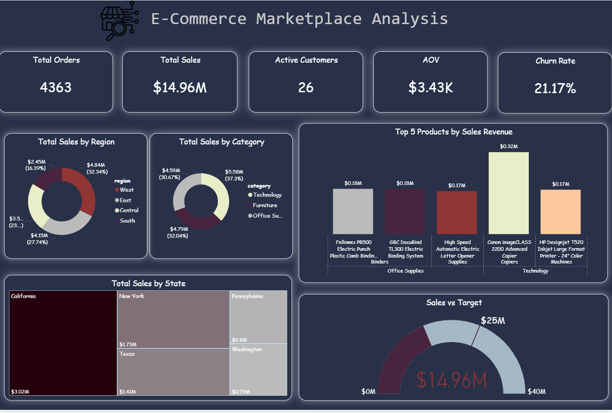
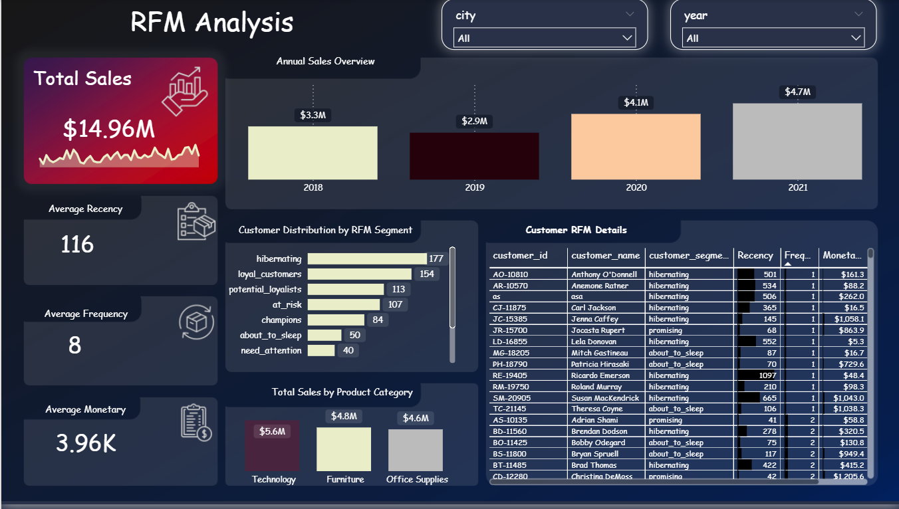
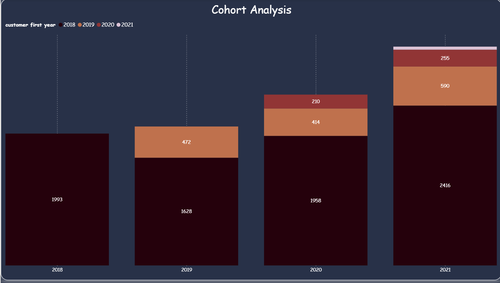
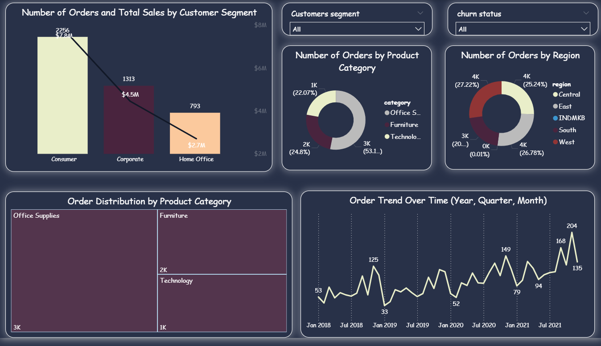

# 📊 E-Commerce Customer Analytics & Churn Project

## 🔎 Project Overview

This project focuses on analyzing customer behavior in an e-commerce marketplace using transactional data.  
It aims to:

- Understand **customer lifecycle**
- Identify **churned, active, and new customers**
- Perform **RFM segmentation**
- Build **cohort analysis and retention curves**
- Visualize business KPIs through **interactive dashboards**


## 🗂 Dataset

The dataset contains order-level transactional data including:

- Customer information (ID, Segment, City, Region)  
- Order details (Order Date, Product, Category)  
- Sales metrics (Sales, Profit, Discount, Quantity)

---

## 🛠 Tools & Technologies

- **Python**  
- **Pandas, NumPy**  
- **Plotly**  
- **Power BI / Dashboards**  
- **Jupyter Notebook**

---

## ⚙️ Feature Engineering

Derived features and flags were created, including:

- **Active vs Inactive Customers** (based on last 90 days of activity)  
- **Repeat Customers**  
- **New Customers (monthly)**  
- **Churned Customers (monthly)**  
- **RFM Metrics**: Recency, Frequency, Monetary  
- **Customer Segments** based on RFM score (Champions, Loyal, At Risk, etc.)

---

## 📈 Business KPIs

The project calculates:

- **Active Customers (Monthly)**  
- **New Customers (Monthly)**  
- **Churn Rate (Monthly)**  
- **Retention Rate**  
- **Average Order Value (AOV)**  
- **Customer Lifetime Value (LTV)**  
- **Top Products & Categories**  
- **Customer Segmentation (RFM)**  

---

## 📊 Dashboards & Visualizations

The dashboards include:

- Cohort Analysis & Retention Curves  
- Active Customers by City (Map)  
- RFM Segmentation Dashboard  
- Sales & Orders Trends Over Time  
- Top Products by Revenue  
- Sales by Region and Category  
- Customer Segment Performance  

---

## 🖼 Dashboard Screenshots


### 🔹 Overall KPI Dashboard  


### 🔹 RFM Analysis Dashboard  


### 🔹 Cohort Analysis  


### 🔹 Orders & Segments  


### 🔹 Active Customers Map  


---

## 📁 Project Structure

```bash
├── data/
│   └── sales.csv
├── notebooks/
│   └── E-Commerce Marketplace Analysis.ipynb
├── dashboards/
│   └── final.pbix
├── images/
│   ├── 1.PNG
│   ├── 2.PNG
│   ├── 3.PNG
│   ├── 4.PNG
│   └── 5.PNG
└── README.md
